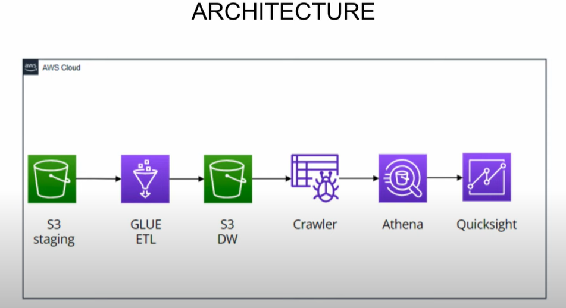

# Spotify-Data-Engineering-Project
Spotify Data Engineering Project using AWS Glue ETL pipeline

## Introduction
Building Spotify data engineering project using AWS cloud. The data will be present in our staging layer and then will be using AWS glue to build our ETL pipeline that will take data from the staging layer and transfer it into the data warehouse. Once our data is placed in Dataware house we will be running a glue crawler that will create a database and populate a table for the database, then we will be using AWS Athena to query the data present in a table once everything is set we use AWS quick sight to do visualization and to gain business insight from our data. The dataset used in this project is Spotify data set 2023..the data set consists of three CSV files album, artist, and track. The Spotify album consists of details of all the albums, tracks, artists, and the release date of the album. Spotify artists consist of details of the artist, name, no of followers,  and the genre. The track consists of a track id. track popularity and explicit.

## Architecture

